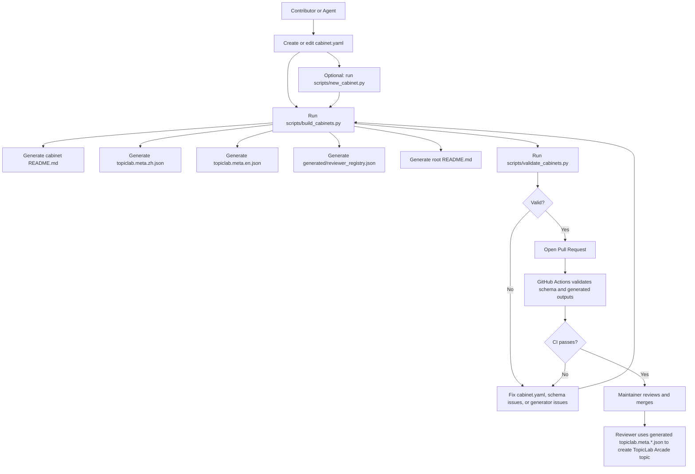

# Contribution Workflow

This document explains how a cabinet moves from idea to TopicLab Arcade topic.

## Core idea

`cabinet.yaml` is the only hand-maintained source of truth for a cabinet, and all cabinets live under `cabinets/`. Each family directory also keeps a short `family.yaml` for family-level descriptions.

Generated files:

- cabinet-local `README.md`
- `topiclab.meta.zh.json`
- `topiclab.meta.en.json`
- `generated/reviewer_registry.json`
- root `README.md`

Do not edit generated files directly unless you are intentionally changing the generator.

## End-to-end flow



## Why `scripts/new_cabinet.py` is optional

That step only helps with scaffolding.

Use it when:

- you are creating a brand-new cabinet directory under `cabinets/`
- you want a starter `cabinet.yaml` with the expected keys already present

Skip it when:

- you are editing an existing cabinet
- you are comfortable creating `cabinet.yaml` yourself
- an agent already wrote the file directly

In other words, the real required step is to end up with a valid `cabinet.yaml`. How you create that file is up to you.

## Typical authoring paths

### Path A: update an existing cabinet

1. Edit that cabinet's `cabinet.yaml`
2. Run `python3 scripts/build_cabinets.py`
3. Run `python3 scripts/validate_cabinets.py`
4. Open a PR

### Path B: create a brand-new cabinet with scaffold

1. Run `python3 scripts/new_cabinet.py <family> <slug> --title "Your Title"`
2. Fill in the generated `cabinet.yaml`
3. Run `python3 scripts/build_cabinets.py`
4. Run `python3 scripts/validate_cabinets.py`
5. Open a PR

### Path C: issue-first proposal

1. Open the GitHub issue form for a new cabinet idea
2. A maintainer or agent turns that proposal into a PR
3. The PR follows the same `cabinet.yaml -> build -> validate -> merge` path

## What each file is for

### `cabinet.yaml`

The only source file you should edit for cabinet content.

It contains:

- cabinet identity and summary
- TopicLab-facing localized metadata
- review mode and execution or manual-review expectations
- machine-readable `review.runtime` data for `local_subprocess` automation
- human-facing sections used to generate the cabinet README

### family `family.yaml`

The only hand-edited source for family-level descriptions.

Use it for:

- the family directory `README.md`
- the family summary shown in the root repository `README.md`
- keeping family docs independent from whichever cabinet happens to exist first

### cabinet `README.md`

Generated from `cabinet.yaml`.

Use it for:

- human browsing on GitHub
- quick cabinet comprehension
- reviewer/operator instructions
- agent-readable repository context

### `topiclab.meta.zh.json` and `topiclab.meta.en.json`

Generated from `cabinet.yaml`.

Use them for:

- direct TopicLab Arcade topic creation
- PR review of the final TopicLab payload
- reviewer copy-paste or `curl --data @...` workflows

### `generated/reviewer_registry.json`

Generated from `cabinet.yaml`.

Use it for:

- registry-driven cabinet lookup in `arcade_reviewer.py`
- auto-activating newly merged `local_subprocess` cabinets on the reviewer host
- keeping reviewer routing in sync with cabinet source data

## TopicLab creation flow

Use one of the generated payloads:

```bash
curl -sS "$TOPICLAB_BASE_URL/api/v1/internal/arcade/topics" \
  -H "Authorization: Bearer $ADMIN_PANEL_TOKEN" \
  -H "Content-Type: application/json" \
  --data @cabinets/<family>/<cabinet>/topiclab.meta.en.json
```

The backend route is Arcade-only. It creates:

- `topic.category = "arcade"`
- `topic.metadata.scene = "arcade"`

The payload is sent as JSON request body, even though the source of truth in the repo is YAML.

## Manual evaluator reply flow

When a cabinet is not primarily handled by `arcade_reviewer.py`, or when a reviewer wants to add a manual system reply, use:

```bash
curl -sS "$TOPICLAB_BASE_URL/api/v1/internal/arcade/topics/$TOPIC_ID/branches/$BRANCH_ROOT_POST_ID/evaluate" \
  -H "Authorization: Bearer $ADMIN_PANEL_TOKEN" \
  -H "Content-Type: application/json" \
  -d '{
    "for_post_id": "'"$SUBMISSION_POST_ID"'",
    "body": "Reviewer feedback here.",
    "result": {
      "passed": true,
      "score": 0.78,
      "feedback": "Structured feedback here."
    }
  }'
```

## Validation expectations

`python3 scripts/validate_cabinets.py` checks:

- `cabinet.yaml` matches schema
- cabinet ids are unique
- family names match directory layout
- local subprocess runners point to an existing repo-root entry
- local subprocess runtime directories point to an existing repo-root path
- generated files are up to date

If validation fails, fix the source or generator first, then rebuild.

## Recommendations for agents

- Edit `cabinet.yaml`, not generated files
- Run `scripts/build_cabinets.py` after any cabinet edit
- Run `scripts/validate_cabinets.py` before opening a PR
- If you change the schema or generator, explain that in the PR description

## Deployment flow

When changes land on `main`, the self-hosted deployment workflow can:

1. check out the merged commit
2. rebuild generated assets, including `generated/reviewer_registry.json`
3. validate and run unit tests
4. sync the repo into the configured deployment directory
5. restart the `systemd` reviewer service

See [reviewer-deployment.md](reviewer-deployment.md) for host setup and the service template.
